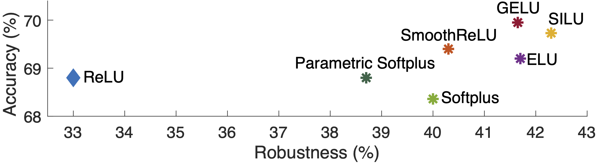

# Smooth Adversarial Training

Code and models for the paper [Smooth Adversarial Training](https://arxiv.org/pdf/2006.14536.pdf).

## Things to do
- [x] Releasing pre-trained ResNet and EfficientNet
- [x] ResNet single-GPU inference
- [x] ResNet multi-GPU inference
- [x] ResNet adversarial robustness evaluation
- [ ] ResNet adversarial training
- [x] EfficientNet single-GPU inference
- [ ] EfficientNet multi-GPU inference
- [ ] EfficientNet adversarial robustness evaluation
- [ ] EfficientNet adversarial training

## Introduction

<div align="center">
  
</div>

The widely-used ReLU activation function significantly weakens adversarial training due to its non-smooth nature. In this project, we developed smooth adversarial training (SAT), in which we replace ReLU with its smooth approximations (e.g., SILU, softplus, SmoothReLU) to strengthen adversarial training. 

On ResNet-50, the best result reported by SAT on ImageNet is 69.7% accuracy and 42.3% robustness, beating its ReLU version by 0.9% for accuracy and 9.3% for robustnes.

We also explore the limits of SAT with larger networks. We obtain the best result by using EfficientNet-L1, which achieves 82.2% accuracy and 58.6% robustness on ImageNet.


## Dependencies:

+ TensorFlow ≥ 1.6 with GPU support
+ Tensorpack ≥ 0.9.8
+ OpenCV ≥ 3
+ ImageNet data in [its standard directory structure](https://tensorpack.readthedocs.io/modules/dataflow.dataset.html#tensorpack.dataflow.dataset.ILSVRC12) for ResNet.
+ ImageNet data in [TFRecord format](https://github.com/tensorflow/tpu/blob/master/tools/datasets/imagenet_to_gcs.py) for EfficientNet
+ [gdown] (https://pypi.org/project/gdown/) for downloading pretrained ckpts


## Model Zoo:

Note:

1. Here are the scripts for downloading [ResNet](ResNet/download_resnet.py) and [EfficientNet](EfficientNet/download_efficientnet.py) from Google Drive.
2. For robustness evaluation, the maximum perturbation per pixel is 4, and the attacker is non-targeted.
3. ResNet performance reported here is slightly different from the performance reported in the paper, since the image loader here is slightly different from the [image loader used in the original training/evaluation code](https://github.com/tensorflow/tpu/blob/master/models/official/resnet/imagenet_input.py).

- __To run ResNet-50 with different activation functions__

```bash
python main.py --activation-name=$YOUR_ACTIVATION_FUNCTION --load=$YOUR_MODEL_DIR --data=$PATH_TO_IMAGENET --eval-attack-iter=$YOUR_ATTACK_ITERATION_FOR_EVAL --batch=$YOUR_EVALUATION_BATCH_SIZE --eval --attack-epsilon=4.0 -d=50 --attack-step-size=1.0 
```

<table>
<thead>
<tr>
<th align="left" rowspan=2>ResNet-50  (click for details)</th>
<th align="center">error rate (%)</th>
<th align="center" colspan=3>error rate(%)</th>
</tr>
<tr>
<th align="center">clean images</th>
<th align="center">10-step PGD</th>
<th align="center">20-step PGD</th>
<th align="center">50-step PGD</th>
</tr>
</thead>


<tbody>
<tr>
<td align="left"><details><summary>ReLU</summary> <code>--activation-name=relu</code></details></td>
<td align="center">68.7</td>
<td align="center">35.3</td>
<td align="center">33.7</td>
<td align="center">33.1</td>
</tr>

<tr>
<td align="left"><details><summary>SILU</summary> <code>--activation-name=silu</code></details></td>
<td align="center">69.7</td>
<td align="center">43.0</td>
<td align="center">42.2</td>
<td align="center">41.9</td>
</tr>

<tr>
<td align="left"><details><summary>ELU</summary> <code>--activation-name=elu</code></details></td>
<td align="center">69.0</td>
<td align="center">41.6</td>
<td align="center">40.9</td>
<td align="center">40.7</td>
</tr>

<tr>
<td align="left"><details><summary>GELU</summary> <code>--activation-name=gelu</code></details></td>
<td align="center">69.9</td>
<td align="center">42.6</td>
<td align="center">41.8</td>
<td align="center">41.5</td>
</tr>

<tr>
<td align="left"><details><summary>SmoothReLU</summary> <code>--activation-name=smoothrelu</code></details></td>
<td align="center">69.3</td>
<td align="center">41.3</td>
<td align="center">40.4</td>
<td align="center">40.1</td>
</tr>

<tr>
<td align="left"><details><summary>Res</summary> <code>--activation-name=silu</code></details></td>
<td align="center">69.7</td>
<td align="center">43.0</td>
<td align="center">42.2</td>
<td align="center">41.9</td>
</tr>
</tbody>
</table>


- __To run ResNet with SAT at different scales__

```bash
python main.py  -d=$NETWORK_DEPTH --res2-bottleneck=$RESNEXT_BOTTLENECK --group=$RESNEXT_GROUP --input-size=$INPUT_SIZE --load=$YOUR_MODEL_DIR --data=$PATH_TO_IMAGENET --eval-attack-iter=$YOUR_ATTACK_ITERATION_FOR_EVAL --batch=$YOUR_EVALUATION_BATCH_SIZE --eval --attack-epsilon=4.0 -d=50 --attack-step-size=1.0 --activation-name=silu
```
<table>
<thead>
<tr>
<th align="left" rowspan=2>SAT ResNet (click for details)</th>
<th align="center">error rate (%)</th>
<th align="center" colspan=3>error rate(%)</th>
</tr>
<tr>
<th align="center">clean images</th>
<th align="center">10-step PGD</th>
<th align="center">20-step PGD</th>
<th align="center">50-step PGD</th>
</tr>
</thead>
  
<tr>
<td align="left"><details><summary>ResNet-50</summary> <code>--d=50 --res2-bottleneck=64 --group=1 --input-size=224</code></details></td>
<td align="center">69.7</td>
<td align="center">43.0</td>
<td align="center">42.2</td>
<td align="center">41.9</td>
</tr>

<tr>
<td align="left"><details><summary>(2X deeper) ResNet-101 </summary> <code>--d=101 --res2-bottleneck=64 --group=1 --input-size=224</code></details></td>
<td align="center">72.9</td>
<td align="center">46.4</td>
<td align="center">45.5</td>
<td align="center">45.2</td>
</tr>

<tr>
<td align="left"><details><summary>(3X deeper) ResNet-152</summary> <code>--d=152 --res2-bottleneck=64 --group=1 --input-size=224</code></details></td>
<td align="center">74.0</td>
<td align="center">47.3</td>
<td align="center">46.2</td>
<td align="center">45.8</td>
</tr>

<tr>
<td align="left"><details><summary>(2X wider) ResNeXt-32x4d</summary> <code>--d=50 --res2-bottleneck=4 --group=32 --input-size=224</code></details></td>
<td align="center">71.1</td>
<td align="center">43.3</td>
<td align="center">42.5</td>
<td align="center">42.2</td>
</tr>

<tr>
<td align="left"><details><summary>(4X wider) ResNeXt-32x8d</summary> <code>--d=50 --res2-bottleneck=8 --group=32 --input-size=224</code></details></td>
<td align="center">73.3</td>
<td align="center">46.3</td>
<td align="center">45.2</td>
<td align="center">44.8</td>
</tr>

<tr>
<td align="left"><details><summary>(299 resolution) ResNet-50</summary> <code>--d=50 --res2-bottleneck=64 --group=1 --input-size=299</code></details></td>
<td align="center">70.7</td>
<td align="center">44.6</td>
<td align="center">43.8</td>
<td align="center">43.6</td>
</tr>

<tr>
<td align="left"><details><summary>(380 resolution) ResNet-50</summary> <code>--d=50 --res2-bottleneck=64 --group=1 --input-size=380</code></details></td>
<td align="center">71.6</td>
<td align="center">44.9</td>
<td align="center">44.1</td>
<td align="center">43.8</td>
</tr>

<tr>
<td align="left"><details><summary>(3X deeper & 4X wider & 380 resolution) ResNeXt152-32x8d</summary> <code>--d=152 --res2-bottleneck=8 --group=32 --input-size=380</code></details></td>
<td align="center">78.0</td>
<td align="center">53.0</td>
<td align="center">51.7</td>
<td align="center">51.0</td>
</tr>
</tbody>
</table>


- __To run EfficientNet with SAT at different scales__

```bash
python main.py --model_name=$EFFICIENTNET_NAME --moving_average_decay=$EMA_VALUE --ckpt_path=$YOUR_MODEL_DIR --data_dir=$PATH_TO_IMAGENET_TFRECORDS --eval_batch_size=$YOUR_EVALUATION_BATCH_SIZE --use_tpu=false --mode=eval --use_bfloat16=false --transpose_input=false --strategy=gpus --batch_norm_momentum=0.9 --batch_norm_epsilon=1e-5 --sat_preprocessing=True
```
<table>
<thead>
<tr>
<th align="left" rowspan=2>SAT EfficientNet (click for details)</th>
<th align="center">error rate (%)</th>
<th align="center" colspan=3>error rate(%)</th>
</tr>
<tr>
<th align="center">clean images</th>
<th align="center">10-step PGD</th>
<th align="center">20-step PGD</th>
<th align="center">50-step PGD</th>
</tr>
</thead>
  
<tr>
<td align="left"><details><summary>EfficientNet-B0</summary> <code>--model_name=efficientnet-b0 --moving_average_decay=0</code></details></td>
<td align="center">65.2</td>
<td align="center">TODO</td>
<td align="center">TODO</td>
<td align="center">TODO</td>
</tr>

<tr>
<td align="left"><details><summary>EfficientNet-B1</summary> <code>--model_name=efficientnet-b1 --moving_average_decay=0</code></details></td>
<td align="center">68.6</td>
<td align="center">TODO</td>
<td align="center">TODO</td>
<td align="center">TODO</td>
</tr>

<tr>
<td align="left"><details><summary>EfficientNet-B2</summary> <code>--model_name=efficientnet-b2 --moving_average_decay=0</code></details></td>
<td align="center">70.3</td>
<td align="center">TODO</td>
<td align="center">TODO</td>
<td align="center">TODO</td>
</tr>

<tr>
<td align="left"><details><summary>EfficientNet-B3</summary> <code>--model_name=efficientnet-b3 --moving_average_decay=0</code></details></td>
<td align="center">73.1</td>
<td align="center">TODO</td>
<td align="center">TODO</td>
<td align="center">TODO</td>
</tr>

<tr>
<td align="left"><details><summary>EfficientNet-B4</summary> <code>--model_name=efficientnet-b4 --moving_average_decay=0</code></details></td>
<td align="center">75.9</td>
<td align="center">TODO</td>
<td align="center">TODO</td>
<td align="center">TODO</td>
</tr>

<tr>
<td align="left"><details><summary>EfficientNet-B5</summary> <code>--model_name=efficientnet-b5 --moving_average_decay=0</code></details></td>
<td align="center">77.8</td>
<td align="center">TODO</td>
<td align="center">TODO</td>
<td align="center">TODO</td>
</tr>

<tr>
<td align="left"><details><summary>EfficientNet-B6</summary> <code>--model_name=efficientnet-b6 --moving_average_decay=0</code></details></td>
<td align="center">79.2</td>
<td align="center">TODO</td>
<td align="center">TODO</td>
<td align="center">TODO</td>
</tr>

<tr>
<td align="left"><details><summary>EfficientNet-B7</summary> <code>--model_name=efficientnet-b7 --moving_average_decay=0</code></details></td>
<td align="center">79.8</td>
<td align="center">TODO</td>
<td align="center">TODO</td>
<td align="center">TODO</td>
</tr>

<tr>
<td align="left"><details><summary>EfficientNet-L1</summary> <code>--model_name=efficientnet-bL1 --moving_average_decay=0</code></details></td>
<td align="center">80.7</td>
<td align="center">TODO</td>
<td align="center">TODO</td>
<td align="center">TODO</td>
</tr>

<tr>
<td align="left"><details><summary>EfficientNet-L1-Enhanced</summary> <code>--model_name=efficientnet-bL1 --moving_average_decay=0.9999</code></details></td>
<td align="center">82.2</td>
<td align="center">TODO</td>
<td align="center">TODO</td>
<td align="center">TODO</td>
</tr>
</tbody>
</table>

## Acknowledgements

The <b>MAJOR</b> part of this code comes from [ImageNet-Adversarial-Training](https://github.com/facebookresearch/ImageNet-Adversarial-Training) and [EfficientNet](https://github.com/tensorflow/tpu/tree/master/models/official/efficientnet). We thanks [Yingwei Li](https://yingwei.li/) and [Jieru Mei](https://scholar.google.com/citations?user=nHKExN0AAAAJ&hl) for helping open resource the code and models.

## Citation

If you use our code, models or wish to refer to our results, please use the following BibTex entry:
```
@article{Xie_2020_SAT,
  author  = {Xie, Cihang and Tan, Mingxing and Gong, Boqing and Yuille, Alan and Le, Quoc V},
  title   = {Smooth Adversarial Training},
  journal = {arXiv preprint arXiv:2006.14536},
  year    = {2020}
}
```
